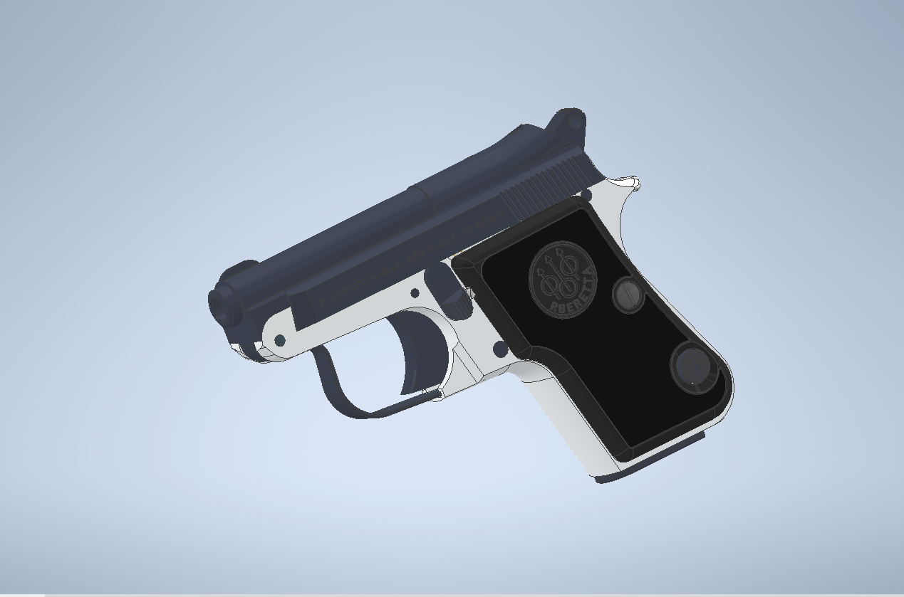
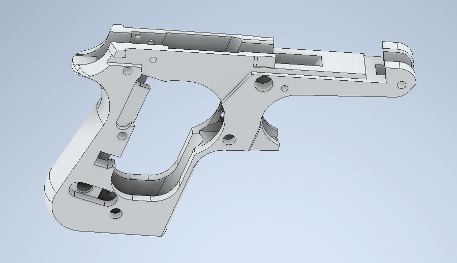

# 3D Printable Receiver for the .22 short Beretta 950b Minx

 

Designed by **HulkHoganHH** ([steamcommunity.com/id/HulkHoganHH](steamcommunity.com/id/HulkHoganHH), discord:HulkHoganHH#3508, [thehulksterHH@gmail.com](thehulksterHH@gmail.com))

- **Open source**, make changes you see fit
- Designed, **not yet tested**.
- Basic hand tool skills may be required
- Print in PETG, PLA+, or any stronger material

 

**Use with caution, this design was translated from a grabcad depository to STL format. Not yet enforced.**
 
I take no responsibility for any criminal activity committed with these files and will deny any involvement with any criminal parties. This is a semi automatic pocket gun. Do not manufacture without a proper license. Any trouble you get into is your fault.
